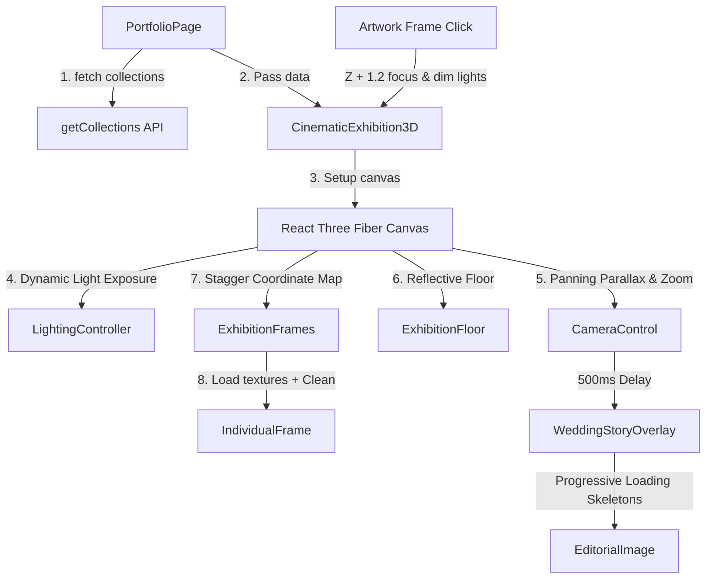
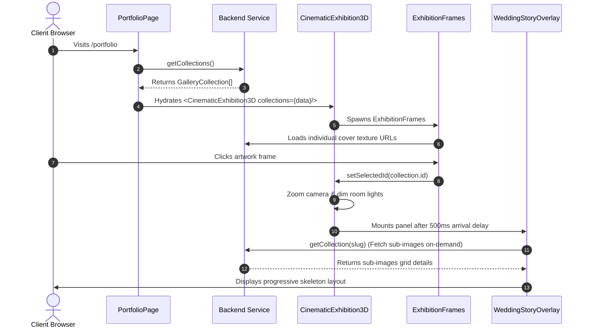

# Cinematic Exhibition Gallery & Editorial Portfolio
## Technical Reference, Performance, & Accessibility Guide

This document serves as the complete technical manual for the **Cinematic Exhibition Gallery** built for the Artisans Co. website. It outlines the three-dimensional rendering pipeline, component relationships, data integration lifecycles, and performance engineering systems.

---

## 1. Project Overview

### Purpose
The Cinematic Exhibition Gallery provides an ultra-premium, interactive showcase of wedding and portrait collections. It replaces traditional grid-based galleries with an atmospheric, virtual museum hall designed to match the editorial styling of luxury publications (such as Vogue) and modern art galleries.

### Design Philosophy
- **Minimalist Luxury**: Framed artwork is surrounded by space, charcoal borders, and warm gold accents.
- **Atmospheric Lighting**: Soft ambient fill light combined with a dynamic spotlight beam creates a "spotlight room" experience.
- **Cinematic Pacing**: Smooth inertial camera movements, gradual image fade-in animations, and a 500ms transition delay before loading textual overlays.

### User Experience Goals
- Establish an interactive 3D space that responds to cursor parallax coordinates.
- Allow users to "walk up" to a piece of art (frame zoom), dimming the background elements, raising the spotlight intensity, and displaying an editorial description page alongside progressive image grids.
- Guarantee high rendering frame rates (60 FPS) across desktop, tablet, and mobile browsers.

---

## 2. System Architecture



### High-Level Life Cycle Systems

#### 1. Data Hydration & Fallback Lifecycle
1. On-mount, `PortfolioPage` triggers `getCollections()`.
2. Loaded collections hydrate state arrays and are passed down to `CinematicExhibition3D`.
3. If no database records are retrieved, the component initializes a curated fallback mock list (`localMockCollections`) representing classic luxury wedding events, utilizing the local placeholder asset to maintain visual presentation without external network calls.

#### 2. Camera Parallax & Selected Focus Lifecycle
- **Parallax (Normal)**: Reads the cursor coordinates `state.pointer` within the `useFrame` loop, translating it into horizontal camera offsets dampended by viewport scale constraints.
- **Zoom-In Focus**: On selecting a frame, pointer parallax is locked, and the camera coordinate vector interpolates (`lerp`) to face directly in front of the selected frame's coordinates (`[pos[0], pos[1], pos[2] + 3.4]`).
- **Offset Offset (Overlay Open)**: Once the camera arrives, the layout shifts the camera coordinates left (`pos[0] - 1.2`), positioning the physical 3D frame on the right side of the screen, leaving the left side open for the description overlay.
- **Return**: Resets the selection state, pulling the camera back to base parallax values.

#### 3. Spotlight Lifecycle
- The spotlight tracks target focus coordinates using a lerping node (`targetRef`).
- When a frame is hovered or selected, the spotlight target lerps to the frame's position.
- If selected, spotlight intensity scales up from `16` to `32` to isolate the focus piece.

#### 4. Overlay Lifecycle
- When the camera completes its travel, a clock ref measures 500ms before enabling `showOverlay = true`, sliding in the panel.
- On-mount, background scrolling is disabled (`document.body.style.overflow = 'hidden'`) and the keyboard Tab index captures focus inside the panel.
- Exiting fades out the panel, restores body scrolling, and returns focus to the last selected element.

#### 5. Resource Cleanup Lifecycle (Disposal)
- On unmounting frames or loading new cover textures, the `useEffect` cleanup hook calls `texture.dispose()` on the resolved WebGL texture. This prevents GPU heap leaks.

---

## 3. Component Reference

### PortfolioPage
- **Purpose**: Page-level wrapper for the `/portfolio` route.
- **Responsibilities**: Fetches collection details, updates document metadata (SEO title, canonical links), and controls the top-level site navigation layout.
- **Props**: None (page level).
- **State**:
  - `collections: GalleryCollection[]` - Cached database records.
  - `detail: PublicCollectionDetail | null` - Portfolio header metadata.
- **Dependencies**: `getCollections`, `getCollection`, `updateSEOMetadata`.
- **Performance**: Fetches all collections initially, but delays detail queries of sub-images until user selection.

### CinematicExhibition3D
- **Purpose**: Initializes the `<Canvas>` environment and maps UI components.
- **Responsibilities**: Orchestrates coordinates, coordinates light variables, manages selection hooks, and renders fallback overlays.
- **Props**: `collections?: GalleryCollection[]`
- **State**:
  - `selectedId: string | null` - Active frame index.
  - `showOverlay: boolean` - Visibility state for description details.
  - `selectedDetail: PublicCollectionDetail | null` - Fetched details object.
  - `loadingDetail: boolean` - Loader state.
- **Dependencies**: React Three Fiber, `@react-three/drei`, `lucide-react`.

### ExhibitionFloor
- **Purpose**: Atmospheric environment base floor plane.
- **Responsibilities**: Reflects floating frames dynamically.
- **Props**: None.
- **State**: None (reads viewport size from R3F `useThree` context).
- **Performance**:
  - **Desktop**: resolution `1024` real-time reflector map.
  - **Tablet**: resolution `256` reflector map with heavy blur.
  - **Mobile**: standard standard material (fully disables reflection computations to save draw calls).

### ExhibitionFrames
- **Purpose**: Spawns and maps gallery frames down the hall.
- **Responsibilities**: Renders meshes, sets up individual frames, and feeds selection click bounds.
- **Props**:
  - `collections: GalleryCollection[]`
  - `hoveredId: string | null`
  - `setHoveredId: (id: string | null) => void`
  - `selectedId: string | null`
  - `setSelectedId: (id: string | null) => void`

### IndividualFrame (Sub-component)
- **Purpose**: Single floating frame mesh.
- **Responsibilities**: Loads and disposes cover textures, translates floating Z-coordinates, scales borders, and animates defocus dimming.
- **State**:
  - `texture: THREE.Texture | null` - Resolved cover image.
  - `textureOpacity: number` - Fade-in target.
  - `textAlpha: number` - Typography opacity.
- **Performance**: Calls `texture.dispose()` on cleanup. Lerps texture opacity to prevent snaps.

### CameraControl
- **Purpose**: Controls the viewport perspective.
- **Responsibilities**: Parallax panning, breathing loops, and target selected zooms.
- **Props**: `selectedId`, `showOverlay`, `collections`, `onArrivalComplete`, `prefersReducedMotion`.
- **State**: Focus vector refs.

### LightingController
- **Purpose**: Simulates auto-exposure.
- **Responsibilities**: Smoothly dims background lights when selection zooms are active.
- **Props**: `selectedId`.

### SpotlightController
- **Purpose**: Golden accent lighting.
- **Responsibilities**: Targets the active frame and raises light levels.
- **Props**: `selectedId`, `hoveredId`, `collections`.

### WeddingStoryOverlay
- **Purpose**: Displays collection story description and images.
- **Responsibilities**: Focus trapping, Escape close listeners, metadata grid mapping, and footer navigation.
- **Props**: `detail`, `loading`, `onClose`.
- **State**: Keyboard cycle indexes.

### EditorialImage
- **Purpose**: Progressive image display.
- **Responsibilities**: Skeleton loading loops and image opacity scaling.
- **Props**: `src`, `alt`, `isTall`.
- **State**: `loaded: boolean`, `error: boolean`.

---

## 4. Directory Structure

```
src/
├── components/
│   └── gallery/
│       ├── AnimatedPageWrapper.tsx          # Page exit fade transition wrapper
│       ├── CinematicExhibition3D.tsx        # Main 3D Canvas initialization & rigs
│       ├── ExhibitionFloor.tsx              # Responsive WebGL floor reflection mesh
│       ├── ExhibitionFrames.tsx             # Floating frames layout & texture lifecycles
│       └── WeddingStoryOverlay.tsx          # Framer Motion accessible descriptions overlay
├── pages/
│   └── PortfolioPage.tsx                    # Top-level portfolio route coordinator
└── services/
    └── gallery.ts                           # Database fetching services and type models
```

---

## 5. Data Flow Sequence



---

## 6. Performance Engineering

### Reflection Optimization
Floor reflection calculations are modified responsively using the canvas viewport size `useThree().size` to match hardware constraints:
- **Mobile (<600px)**: The reflector material is swapped for a basic `meshStandardMaterial` with `roughness={0.9}`. This completely bypasses the secondary camera frame rendering loop, keeping mobile frame rates at 60 FPS.
- **Tablet (600px - 1024px)**: Capped resolution at `256` with high blur, preserving visual reflections without heating up mobile GPUs.
- **Desktop (>1024px)**: High resolution reflections (`1024` map) with metalness mapping.

### Texture Lifecycle (Disposal)
WebGL does not automatically collect garbage textures when components unmount, which leads to memory leaks. This app implements strict memory collection:
```tsx
useEffect(() => {
  let active = true;
  let loadedTex: THREE.Texture | null = null;
  
  loader.load(url, (tex) => {
    if (active) {
      setTexture(tex);
      loadedTex = tex;
    }
  });

  return () => {
    active = false;
    if (loadedTex) {
      loadedTex.dispose(); // Releases texture data from GPU VRAM
    }
  };
}, [url]);
```

### Lazy Loading Strategy
- Cover textures are only fetched when mounting frames.
- Secondary images inside the description grids are only queried and loaded *after* selection occurs, reducing initial network payloads.
- Images in the grid utilize native `loading="lazy"` tags.

---

## 7. Accessibility Implementation

### Focus Trapping Loop
When the editorial overlay is open, focus traps ensure standard keyboard tabbing remains enclosed inside the panel:
```tsx
const focusableElements = containerRef.current.querySelectorAll<HTMLElement>(
  'button, [href], input, select, textarea, [tabindex]:not([tabindex="-1"])'
);
const firstElement = focusableElements[0];
const lastElement = focusableElements[focusableElements.length - 1];

if (e.shiftKey) {
  if (document.activeElement === firstElement) {
    lastElement.focus();
    e.preventDefault();
  }
} else {
  if (document.activeElement === lastElement) {
    firstElement.focus();
    e.preventDefault();
  }
}
```

### Focus Restore
Records the focused element before mount (`previousActiveElementRef.current = document.activeElement`) and returns focus to it upon unmounting, allowing continuous keyboard navigation.

### prefers-reduced-motion Hook
Tracks accessibility configurations. If active, camera pointer parallax translations and idle breathing cycles are disabled.

---

## 8. Maintenance Guide

### How to Add Collections
1. Access the admin CMS dashboard or seed database records.
2. Publish a new collection with a cover image.
3. The coordinate calculator dynamically assignshall offsets for any record size.

### Adjusting Camera Settings
- To change camera transition speeds, modify the lerp values inside [CinematicExhibition3D.tsx](file:///c:/Users/joeln/Downloads/APCO/apco--main-ashwin-main/apco--main-ashwin-main/src/components/gallery/CinematicExhibition3D.tsx#L161):
  - Decrease `0.025` for more camera drag inertia.
  - Increase for faster camera travel.

### Modifying Lights & Lighting
- Modify values inside `LightingController` and `SpotlightController` targets.
- Increase or decrease spotlight angles (`angle={0.45}`) to tighten or widen the golden light cones.

### Tuning Reflections
- Edit resolution parameters in `ExhibitionFloor.tsx` (`resolution={512}` etc.).

---

## 9. Troubleshooting

### 1. Cover Images Not Loading
- **Cause**: Backend API route returned absolute URLs mismatching current origin port, or network block.
- **Fix**: The image loader resolves relative links to the `VITE_API_URL` config. Ensure the `.env` has the correct API port configured.

### 2. Mesh Image Pops and White Flashes
- **Cause**: Image texture mapped before loading completes.
- **Fix**: Re-check `textureOpacity` states. It must map `textureOpacity * targetOpacity` to standard transparent material fields.

### 3. Build Fails on Unused Variables
- **Cause**: Strict TypeScript `noUnusedLocals` lint constraints.
- **Fix**: Ensure all imports are used. Double-check that types are declared outside component rendering loops.

---

## 10. Deployment Checklist

- [ ] **Environment Variables**: Verify `VITE_API_URL` is set to the production server domain.
- [ ] **Build Validation**: Execute `yarn build` and confirm exit code `0`.
- [ ] **Mobile Touch**: Verify swipe/touch panning behaves cleanly on mobile devices.
- [ ] **Accessibility Verify**: Ensure Escape closing, scroll-locks, and focus trapping cycles work as intended.
- [ ] **SEO Check**: Confirm page headers, document titles, and descriptions load dynamically.

---

## 11. Future Roadmap (Non-Functional Enhancements)

- **WebXR Immersive Support**: Allow virtual headset users to step into the gallery space in WebXR.
- **Walkthrough Paths**: Auto-guide cameras down preset paths.
- **Analytics tracking**: Measure visitor engagement times per selected artwork frame.

---

## 12. Appendix

### Glossary
- **R3F**: React Three Fiber (React wrapper for Three.js).
- **Parallax**: Panning camera movement based on mouse displacements.
- **Inertia**: Heavy camera easing curves.
- **Disposal**: Explicit memory cleanups on GPU texture buffers.

### Version History
- **v1.0.0**: Init floating 3D environment.
- **v1.1.0**: Live database collection texture streaming and fallbacks.
- **v1.2.0**: Focus zooms, spotlight tracking controllers, and Framer Motion editorial story layouts.
- **v1.3.0**: Viewport reflection scaling, memory cleanups, prefers-reduced-motion queries, and keyboard focus traps.
